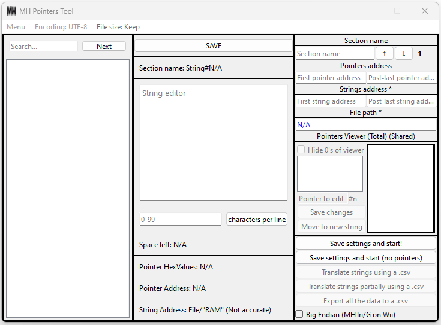

# MH Pointers Tool

This tool can manage the strings of any file that meets [certain parameters](#compatible-estructure), organizing them in a simple GUI where they can be edited/translated, or exported to a csv file. When a string is edited, it can take into account its pointers (if the position/address of those are given by the user), so if a string is edited the pointers will change too, maintaining the logic of where the string is in the file and making possible to get more free space to translate or change strings. You can still use the tool without providing any pointers but the max size of a string will not be altered, in other words, if you overwrite a string with a bigger one the new string will be cut to maintain the size of the original string.

Supports Shift-JIS and UTF8 encodings, Little Endian and Big Endian.

It also has a lot of other [features](#features), check below to know more!

## Tested games

This tool was used to translate **Monster Hunter G** for the Playstation 2 from Japanese to English and to extract strings from the files of several other **Monster Hunter** games.

It has been also tested with **Monster Hunter Portable**, **Monster Hunter 2 (Dos)**, **Monster Hunter G Wii**, **Monster Hunter Tri (E)** (The Japanese release has a weird encryption, so I was not able to test it there) and both **Monster Hunter Portable 3rd** **non**-**HD** and **HD** versions with excellents results.

The strings of any game that has files with a similar structure must be also editable with this tool.

I want to add that some of the before-mentioned games (the PS2 ones) were made using [CodeWarrior](https://en.wikipedia.org/wiki/CodeWarrior), these files have as header MWo3 (Metrowerks overlay 3?). 

If you do some successful testing with any other games, please let me know to add it to this list ^-^O.

## Compatible structure

- The strings must be together but separated from each other by at least one null value (00).

Example: 
82 50 00 82 51 00 82 52 00

These hex values are "１　２　３".

- The pointers must be 4 bytes each. Can be both Big Endian (BE) or Little Endian (LE). Theoretically, they can be bigger, but bigger ones have not been tested yet since I don't have something to test them in the first place.

Examples:<br />
<pre>
F0 F3 2C 00 10 F4 2C 00 30 F4 2C 00 //LE

78 1F 00 00 79 1F 00 00 92 1F 00 00 //LE

00 00 17 68 00 00 17 70 00 00 17 80 //BE

80 62 95 B4 80 62 95 C4 80 62 AE 14 //BE</pre>

Each line has 4 different pointers.

## Values to set up

You will need at least 2 values in hexadecimal (without 0x), the address of the first string and the address of the next byte different from 00 that goes after the last string. The Hex values must be Big Endian.

Example:<br />
<pre>
Offset   00 01 02 03 04 05 06 07 08 09 0A 0B 0C 0D 0E 0F<br />
00000000 00 00 00 00 00 00 00 00 00 00 00 00 00 00 00 00<br />
00000010 00 00 00 00 00 00 00 00 00 00 00 00 00 00 00 00<br />
00000020 82 50 00 00 82 51 00 00 82 52 00 00 01 02 03 00<br /></pre>

The values to use would be 20 for the start and 2C for the end.

The same goes for the address of the pointers.

To find these addresses you can use any standard hex editor like MadEdit.

## How does it look?


## Features

-    **Easy handling** 

You need two hex addresses (without 0x), the first string address, and an address that marks the end of it group of strings. You will also need to choose a file, both by clicking Menu>Load file>Choose a file or **drag and dropping it**. Optionally you can add the address of the first string pointer and an address that marks the end of it group of pointers, by doing this each string can be edited more freely as long as there is enough free space (extra null values), since it is possible to make the strings longer than they were originally.

Note: If a string is overwritten by a bigger one while using pointers, the last string will be cut to maintain the size of the file if there is not enough space.

-    **Strings and pointers editor** 

This tool can get the strings that are separated from each other by a null value (00) and make a list of them to be edited easily. Also has an option to limit the number of characters per line, in case the width of an in-game window can't be changed.

Additionally, there is a different list for pointers. Pointers on the list are updated automatically when a string that matches with any of them is edited. They also can be edited manually or even change their values to relocate it string after the last string of the section.

Note: By default the pointers are read in Little Endian but they can be read in Big Endian by checking that option before starting.

-   **Search string** 

Search for a string or part of it on the string list.

-   **A lot of additional info**

Available space to edit (calculated using null values), strings address, pointers address, pointers value etc.

-   **Organize each section that is being translated** 

You can add a name to classify each part of a group of strings that is being translated. This is called 'Section name'. In other words, represents a region of the file.

-   **Cvs translation support** 

Do you already have a spreadsheet with the original text and the translated one? This tool has the option to translate the strings by using a UTF8 ".csv". The .csv must be divided by semicolons (not commas) and contain two columns. The first column must have the translated strings and the second one is for the untranslated text. Each string must be separated from another with at least one row of space and both strings must start in the same row.

Examples:


There are 4 different strings in this example.

-   **Exportable data (1.1.0 Update)**

You can export to a .csv:
1) Only strings of one specific section.
2) Strings and the rest of data (pointers, addresses, etc.) of one specific section.
3) Strings of all the following sections.
4) Strings and the rest of the data of all the adjacent sections.

If the pointers table mode is ON, you can even export the strings or all the data from all .pt files in the Pointers Tables folder. Optionally, you can add or remove the name of each file/section that will be exported.

When exported, the following changes will be made to the exported text automatically:

* If a line of text contains a semicolon, quotation marks will be added at the end and start of the line.

* If a line of text starts with '-' or '+', a space will be added at the start of it.

* If a string contains one or more new lines between two sentences, a space will be added at the start of each new line. This ensures that a string with one or more new lines between sentences can be taken like one big string instead of separated into little strings since that space is used to separate one string from another one when a csv translation or an alignment is done.

All these little changes are made to the exported text to ensure compatibility with Excel, csv translation, and csv alignment.

-   **Align (merge) two csv into one file (1.1.0 Update)**

Do you have all the original text and their translated counterpart in two different csv but need to align them to do a cvs translation? You can do it automatically by using this feature. It will return a .txt with both texts separated by semicolons, like a cvs format, and all their strings aligned one aside from the other.

Note: Don't try to change it extension and open it directly with Excel, you need to import it and select the correct encoding for the file. Because of this reason, the aligned file is ".txt" and not ".csv".

-   **Pointers table support (1.1.0 Update)**

I will briefly explain their structure.

Some games like **Monster Hunter 2 (Dos)** and **Monster Hunter Portable 3rd** contain files in which strings use pointers tables that point to another pointer instead of directly pointing to a string. This 'main pointers table' or 'pointers table index' uses values that start with an offset of 0 (the start of the file) and each one of them points directly to the first pointer of a 'secondary pointers table'. Each pointer of this 'secondary pointers table' points to a string, using as offset the value of the main pointer + the value of the secondary pointer.

Example:
<pre>
Offset   00 01 02 03 04 05 06 07 08 09 0A 0B 0C 0D 0E 0F<br /> 
00000000 00 00 00 00 00 00 00 00 CC 00 00 00 FF 01 01 00<br />
.<br />
.<br />
.<br />
000000C0 00 00 00 00 00 00 00 00 00 00 00 00 30 1F 00 00<br />
000000D0 31 1F 00 00 00 00 00 00 00 00 00 00 00 00 00 00<br />
.<br />
.<br />
.<br />
00001FF0 00 00 00 00 00 00 00 00 FF FF FF FF 00 80 50 00<br /></pre>

The first main pointer is CC (204 in decimals), and points to 30 1F (7984), 204+7984 = 8188 = 1FFC, the value in 1FFC is null (00) but by using 31 1F (7985) the next value is a string: 80 50 (is １).

This feature will require an interval of two addresses containing all the pointers of the main pointers table (in this case would be 0 and 10 or 08 and 10) and an address that marks the end of the last group of strings. By default, this address is the one from the last value in the file and the field is filled automatically with it, but if the file contains data between the last string and their end is necessary to use the address of this data instead of the default one.

Additionally, for MHP3rd, some particular files needed another value by part of the user, a global offset. This is because the main pointer points to a series of 4 null values, so is necessary to add an extra offset to correct that.

After filling in the required fields, by continuing a new window will appear. Here the user must manually select the pointer(s) that will be used. After that, a .pt (Pointers Tables) file will be created in 'MH-Pointers-Tool/Pointers Tables'. In the .pt file is where all the data related to a Pointers Table is saved, after being made will be loaded automatically but it can also be loaded manually by selecting Menu>Load Pointers Table.

## Installation (Windows and Linux)

Download the latest package and execute it.

For **Windows**, you will also need visual C++ runtime 2015-2022.

For **Linux**, you will also need NodeGui, then execute AppRun via the terminal using a command similar to this:
```
sudo QT_PLUGIN_PATH= PATH_TO_NODEGUI/@nodegui/nodegui/miniqt/6.4.1/gcc_64/plugins ./AppRun
```

## Building from source

### Windows (tested on Windows 11)

1) Download and install Git, NodeJs 19.8.1 or latest, and Cmake.

Note: older NodeJs versions (16.xx-18.xx) could need files from Visual Studio, in that case, install 'windows-build-tools' or Visual Studio.

2) Open gitbash and type:

```
git clone https://github.com/amaillo/MH-Pointers-Tool.git
cd MH-Pointers-Tool
npm install
npm start
```

### Linux

Linux Mint (tested on 21.1 Vera):
```
sudo apt-get update
sudo apt install -y git
sudo apt-get install -y nodejs
sudo apt install -y cmake
sudo git clone https://github.com/amaillo/MH-Pointers-Tool.git
sudo cd usr/lib/node_modules/MH-Pointers-Tool
sudo npm install
sudo npm start
```

Ubuntu (tested on 22.04 Jammy):
```
sudo apt-get update
sudo apt install -y git
sudo apt install -y cmake
sudo apt install libfuse2
sudo apt install npm
sudo npm install -g n
sudo n latest
sudo git clone https://github.com/amaillo/MH-Pointers-Tool.git
cd ~/MH-Pointers-Tool
sudo npm install
sudo npm start
```

### How to pack it

To pack it, go to MH-Pointers-Tool using cd and type:
```
npx nodegui-packer --init MH-Pointers-Tool
```
Then type the following to get the executable:
```
npx nodegui-packer --pack dist
```

For **Linux** users, if AppRun doesn't work, do this:

**Linux mint**
1) Check MH-Pointers-Tool/deploy/linux/build/MH-Pointers-Tool
2) Open qt.conf
3) Change "Plugins: = plugins" to<br />"Plugins = /usr/lib/node_modules/@nodegui/nodegui/miniqt/6.4.1/gcc_64/plugins"

If you have NodeGui installed in another path use that path instead)

**Ubuntu**
1) Open the terminal and type:
```
2) sudo QT_PLUGIN_PATH=~/MH-Pointers-Tool/node_modules/@nodegui/nodegui/miniqt/6.4.1/gcc_64/plugins ./AppRun
```
If you have NodeGui installed in another path use that path instead.

## Special Thanks

To all the members of the MH OldSchool discord for their support and knowledge, join now to play all the Monster Hunters from PS2 online! https://discord.gg/YzmeXb8

## License

MIT
