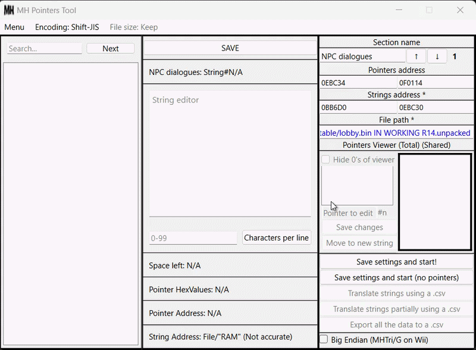
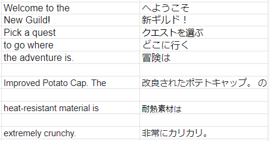

# MH Pointers Tool

This tool can manage the strings of any file that meets [certain parameters](#compatible-structure), organizing them in a simple GUI where they can be edited/translated, or exported to a CSV file. 

When a string is edited, the tool can take its pointers into account (if their addresses/offsets are provided), updating them automatically to maintain file integrity and potentially free up space for longer translations. If you don't provide pointers, the original string length is preserved, and any new text that exceeds it will be truncated.

**Supported encodings:** Shift-JIS and UTF-8 (both Little and Big Endian).

Check the [features](#features) section below to learn more!

## Tested games

This tool was originally used to translate **Monster Hunter G** (PlayStation 2) from Japanese to English, and to extract strings from several other **Monster Hunter** games.

It has also been tested with:
- **Monster Hunter 1** (Japanese)
- **Monster Hunter Portable** (and Freedom)
- **Monster Hunter 2 (Dos)**
- **Monster Hunter G** (Wii)
- **Monster Hunter Tri** (USA, EU and JP)
- **Monster Hunter Portable 3rd** (both non-HD and HD versions)

...with excellent results!

If your game uses files with a similar structure, it should work as well.

## Compatible structure

- **Strings must be contiguous**, separated from each other by at least one null byte (00).

Example:
82 50 00 82 51 00 82 52 00 00 00 00

These hexadecimal values correspond to the fullwidth characters "１　２　３" (1 2 3).

- **Pointers must be 4 bytes each**, and can be either Big Endian (BE) or Little Endian (LE). Larger pointers might work in theory, but haven't been tested due to lack of examples.

Examples (each line shows 4 different pointers):
<pre>
F0 F3 2C 00 10 F4 2C 00 20 F4 2C 00 30 F4 2C 00 //LE

74 1F 00 00 84 1F 00 00 92 1F 00 00 00 2F 00 00 //LE

00 00 20 68 00 00 30 68 00 00 40 68 00 00 52 80 //BE

80 62 95 B4 80 62 95 C4 80 62 AE 14 80 62 AE 14 //BE
</pre>

## Values to set up

You'll need at least two hexadecimal values (without the "0x" prefix):
- The **offset** of the first string
- The **offset** of the first non-null byte after the last string

All offset values must be provided in **Big Endian** format.

Check this example:
<pre>
Offset   00 01 02 03 04 05 06 07 08 09 0A 0B 0C 0D 0E 0F
00000000 4D 57 6F 33 01 00 00 00 00 00 00 00 00 00 00 00<br />
.<br />
.<br />
.<br />
0009A910 00 00 00 00 00 00 00 00 00 00 00 00 00 00 00 00
0009A920 82 50 00 00 82 51 00 00 82 52 00 00 43 65 70 68 // (１　, ２　, ３, Ceph
0009A930 61 6C 6F 73 20 46 69 6E 2B 00 00 00 43 6F 72 61 // alos Fin+, Cora
0009A940 6C 20 43 70 68 6C 6F 73 20 53 63 6C 00 00 00 00 // l Cphlos Scl)  
0009A950 00 00 00 00 00 00 00 00 00 00 00 00 00 00 00 00 // This section contains 5 strings...
0009A960 20 A9 09 00 24 A9 09 00 28 A9 09 00 2C A9 09 00 
0009A970 3C A9 09 00 00 00 00 00 00 00 00 00 00 00 00 00 // and 5 pointers
0009A980 6C 16 00 00 00 00 02 63 08 22 06 00 00 00 00 00 // (unrelated data)
0009A990 D0 07 00 00 C8 00 00 00 00 00 03 63 0C 17 06 00 // (unrelated data)
</pre>

In this example, for strings you would use:
- **Start:** `09A920`
- **End:** `09A960`

For pointers, remember they must be 4 bytes each, so the end offset should be right after the last byte of the last pointer:
- **Start:** `09A960`
- **End:** `09A974` (The last byte of the last pointer is on '09A973', so the correct value to set up is the next one: '09A974')

**Note:** These pointers point to specific offsets within the file. However, you may also encounter pointers that reference memory addresses in the console's RAM.

You can find these offsets using any standard hex editor (like [MadEdit](https://sourceforge.net/projects/madedit/)).

## How does it look?


## Features

- **Easy handling**  
  Load a file via **Menu > Load file** or simply **drag and drop** it. Then, provide two hexadecimal offsets (without "0x"): the start of the string section and the end. 

  Optionally, you can also provide the start and end offsets for a pointer section that matches the strings. This allows you to edit strings more freely, as long as there's enough free space (extra null bytes) to expand them.

  > **Note:** When using pointers, if there isn't enough free space (null bytes) left when saving, the last string with more than 2 characters will be truncated until have only 1. This is to keep the file size and the structure of pointers and strings intact (v1.2.0 and onwards).

- **Strings and pointers editor**  
  The tool scans for null-separated strings and presents them in an editable list. You can also set a character limit per line to match in-game text box constraints.  

  Pointers are displayed in a separate list and update automatically when their target string is edited. You can also edit pointers manually—for example, to relocate a string to the end of the section.

  > **Note:** Pointers are read as Little Endian by default, but you can switch to Big Endian before loading strings.

-   **Search string**<br />
	Quickly find any string (or part of it) within the list.
  
- **Detailed info panel**  
  Displays useful data like available free space, string offsets, and address in RAM (Not accurate), pointer offsets, and pointer values.

- **Section naming**  
  Assign custom names to different string groups to keep your translation organized. Each "section" represents a region of the file. You have 255 sections for each settings file.

- **CSV/Batch translation support**  
  Already have a spreadsheet with original and translated text?  
  The tool can import a UTF-8 `.csv` file (semicolon-separated, not commas) with two columns:  
  - Column 1: Translated text  
  - Column 2: Original text  

  Each string pair must be on the same row, with blank rows between different strings.
  
  > **Note:** With all the offset data set for every section to translate, a game could be translated totally with just a few clicks and a .csv file.

  **Example:**  
    
  *The image above shows 4 different strings in the expected format.*

-	**Exportable data**<br />
	*Added in v1.1.0*

	You can export data to a `.csv` file with the following options:<br />
	1. **Strings only** from a current section.<br />
	2. **All data** (strings, pointers, addresses, etc.) from a current section.<br />
	3. **Strings only** from all sections.<br />
	4. **All data** from all sections.<br />

    If **Pointers Table mode** is active, you can also export strings or all data from every `.pt` file in the `Pointers Tables` folder. You can optionally choose to include or exclude the filename and section name in the export file.

    To ensure compatibility with Excel and other spreadsheet software, the exported text is automatically adjusted:
    - Lines containing a semicolon (`;`) are wrapped in quotation marks.
    - Lines starting with `-` or `+` get a leading space.
    - For strings with line breaks, a space is added at the start of each new line to prevent them from being split into separate entries during CSV import.

-   **Align (merge) two CSV files**<br />
    *Added in v1.1.0*

    If you have two separate CSV files—one with the original text and one with the translation—you can use this feature to automatically merge them into a single, aligned file. The output is a `.txt` file with both texts side-by-side, separated by semicolons, ready to be used for a CSV translation.

    > **Note:** The output file uses the `.txt` extension because it's not recommended to open it directly with Excel. To use it, you must import the text file and select the correct encoding.

-   **Pointers table support**<br />
    *Added in v1.1.0*

    Some games like **Monster Hunter 2 (Dos)** and **Monster Hunter Portable 3rd** contain files in which strings use pointers tables that point to another pointer instead of directly pointing to a string. This 'main pointers table' or 'pointers table index' uses values that start with an offset of 0 (the start of the file), and each one of them points directly to the first pointer of a 'secondary pointers table'. Each pointer of this 'secondary pointers table' points to a string, using as offset the value of the main pointer + the value of the secondary pointer.

    **Example (extracted from MH2):**

    <pre>
    Offset   00 01 02 03 04 05 06 07 08 09 0A 0B 0C 0D 0E 0F
    00000000 55 00 00 00 48 00 00 00 56 00 00 00 6C 05 00 00 //Main pointers
    00000010 57 00 00 00 CA 0B 00 00 58 00 00 00 E7 22 00 00
    00000020 59 00 00 00 F8 24 00 00 5A 00 00 00 FF 24 00 00
    00000030 5B 00 00 00 06 25 00 00 5C 00 00 00 0D 25 00 00
    00000040 FF FF FF FF FF FF FF FF 30 00 00 00 7B 00 00 00 //Secondary pointers #1
    00000050 8B 00 00 00 E5 00 00 00 74 01 00 00 0A 02 00 00
    00000060 7D 02 00 00 03 03 00 00 97 03 00 00 1F 04 00 00
    00000070 A1 04 00 00 01 05 00 00 57 65 6C 6C 20 74 68 65 //Well then! (First set of strings start)
    00000080 6E 21 0A 49 66 20 69 74 27 73 20 65 71 75 69 70 //If it's equip
    .<br />
    .<br />
    .<br />
    00000560 74 20 62 65 20 74 6F 64 61 79 3F 00 44 00 00 00 //Secondary pointers #2
    00000570 57 00 00 00 7E 00 00 00 F8 00 00 00 72 01 00 00
    00000580 EC 01 00 00 56 02 00 00 91 02 00 00 EC 02 00 00
    00000590 53 03 00 00 AA 03 00 00 11 04 00 00 61 04 00 00
    000005A0 C8 04 00 00 40 05 00 00 A7 05 00 00 F7 05 00 00
    000005B0 57 65 20 73 65 6C 6C 20 65 71 75 69 70 6D 65 6E //We sell equipmen (Second set of strings start)
    000005C0 74 2E 00 53 68 6F 70 27 73 20 61 6C 77 61 79 73 //t. Shop's always
    .<br />
    .<br />
    .<br />
    000024F0 65 0A 63 69 74 79 2E 00 04 00 00 00 44 4D 00 04
    00002500 00 00 00 44 4D 00 04 00 00 00 44 4D 00 04 00 00
    00002510 00 44 4D 00 //File ends here
    </pre>

    The first main pointer is `48` at offset 0x4, and points to 0x48; the second one is `6C 05` at offset 0xC and points to 0x056C; the third one is `CA 0B` at offset 0x14 and points to 0x0BCA... you see the pattern?

    To use this feature, you need to provide the **start** and **end** offsets of the **main pointers table** (in this case, `0` and `40`) and the offset that marks the end of the last group of strings. By default, this last field is filled automatically, but if the file contains data between the last string and the end of the file, you must use the offset of that data instead. In this example, the default value (`2513`) is the needed one.

    > **Note for MHP3rd:** Some files require an additional **global offset** provided by the user. This is because the main pointer points to a series of 4 null values, so an extra offset is needed to correct the calculation.

    After filling in the required fields and continuing, a new window will appear. Here, you must manually select the pointer(s) to be used. This creates a `.pt` (Pointers Table) file in the `MH-Pointers-Tool/Pointers Tables` folder. This file contains all the data related to the pointers table and will be loaded automatically in the future. You can also load it manually via **Menu > Load Pointers Table**.
	
	> **Note:** This mode has 2 ways of deciding what to do after editing a string.
	- 'Keep' mode: Will maintain the size of the file. If you delete any character, a null value (00) will be added at the end of the section. If you add any character, it will follow the behaviour of the standard mode.
	- 'Don't keep' mode: Will add or remove characters without maintaining the size of the file, but obviously still will maintain the pointers and strings structure. If the last string is edited and contains extra null values, those will be deleted.

-   **Monster Hunter Quest files (.mib/.bin) support**<br />
    *Added in v1.2.0*

    Text from quest files can now be edited easily! Just put all your `.mib` or `.bin` files in the same folder (make sure they are unencrypted) and then go to Menu > Open all .mib files in folder.
    
	Tested games:
    - MH1 (JP, US, EU)
    - MHG (PS2, Wii)
    - MH2
    - MHP/MHF1 (US, EU)
    - MHP2/MHF2 (US, EU)
    - MHP2G/MHFU (US, EU)
    - MHP3RD
    - MHTri (US, JP, UK/EU)

    > **Note:** This is NOT a quest editor; it only works for the text contained in these files.

-   **CSV template creation**<br />
    *Added in v1.2.0*

    A new menu option allows you to generate a CSV file with the correct format for translations.

-   **Hex viewer (hexView)**<br />
    *Added in v1.2.0*

    A hexadecimal viewer has been integrated into the tool for two specific scenarios:

    1. **When loading a file via Menu > Load**, the hexView window appears, allowing you to visually select the start and end offsets for strings and pointers. You can also search for specific text or hex values within the file.
       
       > **Tip:** To select a range, click two separate squares, or press Shift and drag the mouse (recommended method).

    2. **When using 'Move to new string' without selecting a specific pointer**, hexView lets you choose the new position in the file where the string will be relocated.

## Installation (Windows and Linux)

Download the latest package and execute it.

For **Windows**, you will also need [Visual C++ Runtime 2015-2022](https://aka.ms/vs/17/release/vc_redist.x64.exe).

For **Linux**, you will also need NodeGui. Then execute AppRun via the terminal using a command similar to this:
```
sudo QT_PLUGIN_PATH= PATH_TO_NODEGUI/@nodegui/nodegui/miniqt/6.4.1/gcc_64/plugins ./AppRun
```

## Building from source

### Windows (tested on Windows 11)

1. Download and install [Git](https://git-scm.com/), [Node.js](https://nodejs.org/) (19.8.1 or later), and [CMake](https://cmake.org/).

   > **Note:** Older Node.js versions (16.x–18.x) may require files from Visual Studio. In that case, install `windows-build-tools` or Visual Studio.

2. Open Git Bash and run:

```
git clone https://github.com/amaillo/MH-Pointers-Tool.git
cd MH-Pointers-Tool
npm install
npm start
```

### Linux

Linux Mint (tested on 21.1 Vera):
```
sudo apt-get update
sudo apt install -y git nodejs cmake
git clone https://github.com/amaillo/MH-Pointers-Tool.git
cd usr/lib/node_modules/MH-Pointers-Tool
npm install
npm start
```

Ubuntu (tested on 22.04 Jammy):
```
sudo apt-get update
sudo apt install -y git cmake libfuse2 npm
sudo npm install -g n
sudo n latest
git clone https://github.com/amaillo/MH-Pointers-Tool.git
cd ~/MH-Pointers-Tool
npm install
npm start
```

Arch Linux (tested on March 2026)
```
sudo pacman -S --needed base-devel git nodejs npm cmake fuse2
sudo pacman -S mesa glu
git clone https://github.com/amaillo/MH-Pointers-Tool.git
cd ~/MH-Pointers-Tool
npm install
npm start
```

### How to pack it

To pack it, go to MH-Pointers-Tool using cd and type:
```
npx nodegui-packer --init MH-Pointers-Tool
```
Then type the following to get the executable:
```
npx nodegui-packer --pack dist
```

**For Linux users:** If the resulting AppRun doesn't work, try the following:

**Linux mint**
1. Navigate to `MH-Pointers-Tool/deploy/linux/build/MH-Pointers-Tool`
2. Open `qt.conf`
3. Change `Plugins: = plugins` to <br />`Plugins = /usr/lib/node_modules/@nodegui/nodegui/miniqt/6.4.1/gcc_64/plugins`

(Use your actual NodeGui path if different)

**Ubuntu**
Run the AppRun with the QT plugin path explicitly set:
```
sudo QT_PLUGIN_PATH=~/MH-Pointers-Tool/node_modules/@nodegui/nodegui/miniqt/6.4.1/gcc_64/plugins ./AppRun
```
If you have NodeGui installed in another path, use that path instead.

## Ideas for future versions (Only ideas, I REALLY don't compromise with anything)
- Search for external pointers in standard mode: After establishing the start and end offsets both for pointers and strings, a pop-up will appear asking if there are other offsets where at least 1 of the pointers in the selected interval can be located. You can put them manually or do a "search" in the file or in other files. After completing the process, if another place with the same pointer was located, it will be taken into account while editing strings to maintain it exactly like its counterpart in the interval. This will ensure that even the pointers that are not inside the interval are updated when a string is edited.
- An option to choose if maintaining the 4-byte alignment is needed (currently, the alignment is not maintained; a string can start in 01 or 02 instead of 00, 04, 08, or 0C)
- Auto endianess detection.
- Support for custom encoding tables (.tbl).
- 'Padding byte' definition (currently is null/00 by default, but could be FF, 20, etc.).
- Make the tool usable for 8-byte pointers.
- Fix the duplication string bug in CSV/Batch translation. This rarely happens. Supposedly, occurs when the string 'A' content is changed and matches the string 'B', then both are translated since they have the same content. The system detects it and triggers a warning message to let the user know those strings will need manual correction.

## Support the Project ☕
This tool is completely free and open-source. I built it to solve real headaches in the translation process, focusing on being as general as possible in its core. If it saved you hours of manual hex editing, consider buying me a coffee!

Your support helps me keep the tool updated and motivates me to keep developing new features.

[Support me on Ko-fi](https://ko-fi.com/amaillo)

## Special Thanks

To all the members of the [MH OldSchool Discord](https://discord.gg/YzmeXb8) for their support and knowledge. Join now to play all the Monster Hunters from PS2 online!

## License

MIT
