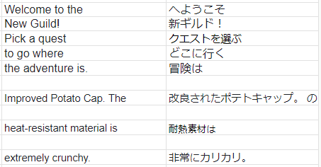

# MH Pointers Tool

This tool can translate Shift-JIS text to UTF8 (and viceversa) in a file. It was used to translate MHG for the PS2 from Japanese to English, so any game that has files with a similar strings and pointers structure must be also editable with it. It has been tested with MHP, MHG Wii, MHTri Europe version (The Japanese one has a weird encription, so i was not able to tested with it) and MHP3rd HD with excellents results. If you make some sucessfully tests with any other game, please let me know to add it to this list ^-^O.

## Compatible estructure

- The strings must be together but separated one from each other by at least one null value (00).

Example: 
82 50 00 82 51 00 82 52 00

These hex values are "1 2 3" in full-width.

- The pointers must be 4 bytes each. Can be both Big Endian (BE) or Little Endian (LE).

Examples:
F0 F3 2C 00 10 F4 2C 00 30 F4 2C 00 //LE

78 1F 00 00 79 1F 00 00 92 1F 00 00 //LE

00 00 17 68 00 00 17 70 00 00 17 80 //BE

80 62 95 B4 80 62 95 C4 80 62 AE 14 //BE

## Values to set up

You will need at least 2 values in hexadecimal (without 0x), the address of the first string and the address of the next byte different from 00 that goes after the last string.

Example:
FF FF FF FF FF FF FF FF FF FF FF FF FF FF FF FF
82 50 00 00 82 51 00 00 82 52 00 00 01 02 03 00

The vales to use would be 10 and 19 (in that order).

The same goes for the pointers address.

To find these address you can use any standar hex editor like MadEdit.

## How does it look?

## Functions

-    **Easy handling** 

You only need the address (without 0x) of the first string and a second address to mark the end of a group of strings. You will also need to choose a file, both cliking Menu>Load file>Choose file or drag and dropping it. Optionally you can add the address of the first string pointer and a address to mark the end of the pointers, by doing this each string can be edited more freely as long as there are enough free space (some null values),since it is possible to make the strings longer than they were originally.

-    **Strings and pointers editor** 

This tool can get the strings that are separated from each other by a null value (00) and make a list of them to be edited easily. Also has a option to limit the amount or characters per line, in case the width of a square in-game can't be changed.

Optionally if the pointers has a 4 bytes format, is possible get those to make a different list for them. In that list, they are updated automatically when a string that match with any of them is edited. They also can be edited manually or even change it values to relocate it string after the last. Note: By default the pointers are read in little endian but you can do it with big endian by checking that option before start.

-   **Search option** 

Search for a string or part of it.

-   **Organize each section that is being translated** 

Optionally, you can add a name to clasify each part of a group of strings that is being translated. This is called 'Section name'.

-   **Spreadsheet support** 

Do you already has a spreadsheet with the original text and also the translated one? This tool has a option to translate the strings by using a UTF8 ".csv". The .csv must be divided by semicolons (not commas) and contain two columns. The first column must have the translated strings and the second one is for the untranslated text. Each string must be separated from another with at least one row of space and both strings must start in the same row.

Examples:

-   **Exportable data**

You can export to a .csv all the strings (and pointers) with it addresses.

-   **And a lot of additional info**

## Installation (Windows and Linux)

Download the latest package. For Windows you will also need visual c++ runtime 2015-2022 and for Linux you will need Nodegui installed.

## Building from source

### Windows (tested on Windows 11)

1) Download and install Git, NodeJs 19.8.1 or latest and Cmake. Note, older versions (16.xx-18.xx) could need files from visual studio, in that case install 'windows-build-tools' or visual studio.

2) Open gitbash and type:

´´´´
git clone https://github.com/mh-pointers-tool/mh-pointers-tool.git
cd mh-pointers-tool
npm install
npm start
npx nodegui-packer --init mh-pointers-tool
npx nodegui-packer --pack dist
´´´´

### Linux (tested on Linux mint)

´´´´
sudo apt install -y git
sudo apt-get install -y nodejs
sudo apt install -y cmake
sudo git clone https://github.com/mh-pointers-tool/mh-pointers-tool.git
sudo cd usr/lib/node_modules/mh-pointers-helper
sudo npm install
sudo npm start

sudo npx nodegui-packer --init mh-pointers-tool
sudo npx nodegui-packer --pack dist
´´´´

If the AppRun file doesn't work, do this:
Check mh-pointers-tool/deploy/linux/build/mh-pointers-tool and change "plugins" in qt.conf to: /usr/lib/node_modules/@nodegui/nodegui/miniqt/6.4.1/gcc_64/plugins

## Special Thanks

To all the members of the MH OldSchool discord for their support and knowledge, join now to play all the Monster Hunters from PS2 online! https://discord.gg/YzmeXb8

## License

MIT